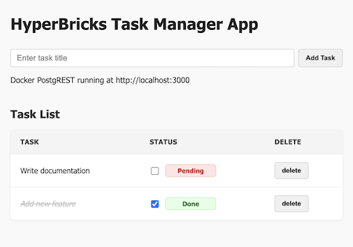

# Task manager (Poc) 
[Hyperbricks](https://github.com/hyperbricks) Task Manager project with [PostgREST](https://postgrest.org/) and [HTMX](https://htmx.org/)

- **Task Manager**: Create, update, and delete tasks.
- **API-Driven**: Uses PostgREST for automatic RESTful API generation from PostgreSQL tables.
- **Declarative UI**: Built with Hyperbricks' `<API_RENDER>` component for dynamic rendering.

---

### 📸 Screenshot

<p align="center">
  
</p>

---


- Hyperbricks installation (v0.6.4-alpha+)

```
go install github.com/hyperbricks/hyperbricks/cmd/hyperbricks@latest
```

- Docker from docker directory (recommended) or PostgreSQL installed
```
cd docker
sudo docker compose up -d
```

> clone the repository
```
git clone https://github.com/hyperbricks/taskmanager.git
cd taskmanager
```

> set POSTGREST_URL (This demo uses http://localhost:3000)
```
export POSTGREST_URL="http://<your_host_here>:<your_port_here>"
```

> Start hyperbricks from root directory (parent of modules/):
```
hyperbricks start -m taskmanager
```


Notes:

- Make sure that $module in `package.hyperbricks` has to be the same as the actual directory.
```
$module = modules/taskmanager
```

- Keep this properties `package.hyperbricks` for auto reload when developing
    - mode = development 
    - development.watch = true
    - development.reload = true
